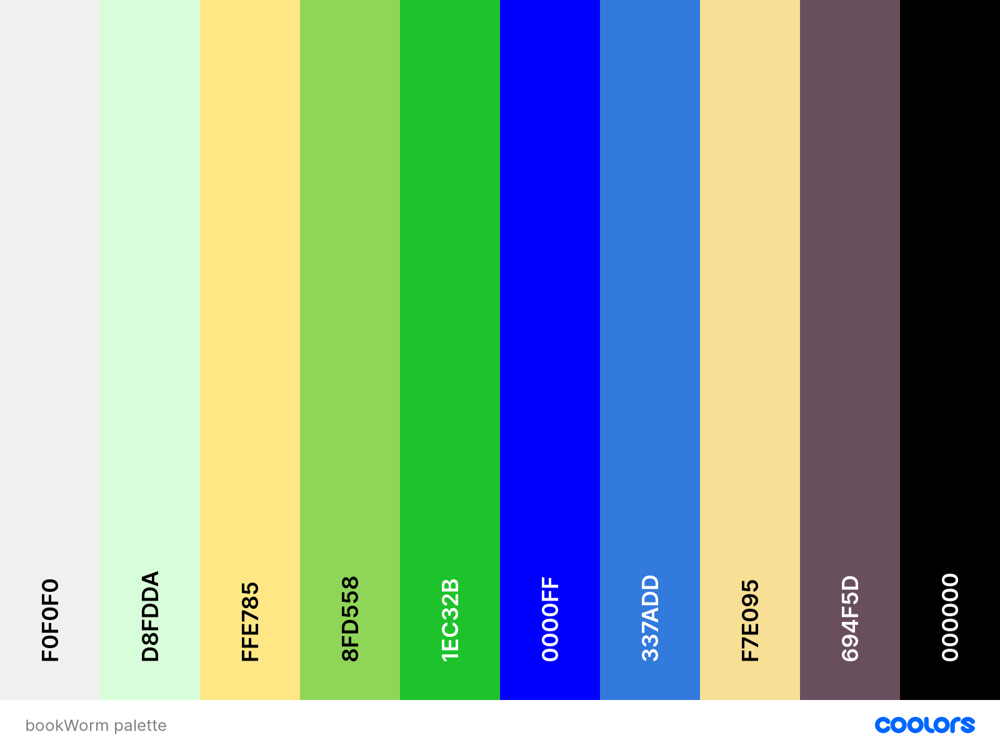

[Link to Deployed Website](https://singeroi-bookworm.herokuapp.com)

# Code Institute Milestone Project 4
## bookWorm A Full Stack Framework with Django 

###   @bookWorm we love a good read

## About bookWorm

## Site purpose
 
This an e-commerce site for promotion of inclusive new literature in the competitive e-novels/comics market. 
Readers are looking for varied content but especially for enovels and eManga.
Site users can browse titles according to type (book, comic) or genre (sci-fi, fantasy or historical). After registration and login users can read sample chapters and then choose to purchase further chapters or a subscription. Users can then review the products they buy. Users can also submit their own works for online publication and/or may offer to act as translators for new works users will receive payment for this. 

## Demo

### Design choices
The design process began with the bookWorm brand logo which uses a strong blue. From this to provide a fresh look I chose a palette based on shades of blue and green selected using the palette tool at [Coolors](https://coolors.co/). Many aspects of the design use bootstrap components for consistency but to give a modern look they have been restyled as, for example, the navbar toggler button which has no border in order to give it a more contemporary look. The font choice for the logo, was determined by experimentation using [Fontastic]() and provides an appealing visual pun.  The design seeks to provide a visually consistent, responsive and easy to navigate user experience.

The layout of the navbar, home and product pages use the format of the Code Instiute BoutiqueAdo project. I chose to retain the format of the 4 navbar buttons including the 'Show Titles' dropdown which provides functions that could be seen as redundant with that of the 'sort by menu'. However the 'sort by menu' appears only on the product pages and therefore I felt it was valuable to users to have the ability to be able to perform the wider searches provided by this dropdown directly from other locations especially from the landing page. 

## UX
This is a test of an English language webnovel publishing site of a type popular in China and of growing popularity elsewhere. The owner's purpose is to provide a source of new eNovels and eManga as well as other online publications that will be if interest to readers. The owner will gather income from purchase of access to publications and individual chapters are usually provided as the main products. Titles are often published in a serialised form with readers awaiting the next installment. Typical access is via mobile devices. The site provides a basic reader function to access content linked to registered user accounts. Some content is normally provided for free as a taster and the site free content is available to any reader. 

The owner also wishes to recruit writers attracted to contribute their work to the genres onsite to become providers of future content as well as translators to provide English and other language content. These users will be paid a fee for their work on paid content. 

Users purchase titles by purchasing credit in their profile on the site using a card (in reality usually methods such as WeChat or Alipay dominate). These then allow purchase of chapters. The presence of credit encourages users to keep returning to the site. Other payment schemes such as subscriptions exist but these are outside the scope of this demo project 

**Potential features to include:**

Considering the needs of possible site users identified these features:

* A store-front to showcase a wide range pof eLiterature

* Allow users to search items based on various fields, e.g. type, genre, author, rating

* Allow users to filter items based on title, genre, rating

* Allow users to see the price, image, ratings and other basic details of titles on the search page

* When viewing a title, users would be able to identify its content and suitability, read a sample, purchase more material, leave a rating

* Allow users to securely purchase title chapters, allow authors/translators to receive payments

* Provide a bookshelf to give rapid access to content purchased by user

* Users have to be registered to purchase, rate, create or translate 

* Allow registered users to rate titles, only if they purchased them

* Include pagination and/or other dynamic and responsive display actions to deal with large datasets.

### User Stories

This site is intended for readers and creators of new eNovels, eComics and other literary works in the growing foreign language publications market of east Asia. These publications re typically provided on a chapter by chapter basis offereing novel challenges in terms of dealing with management and presentation of products.

**_"As a reader I would like"_**
* view all products and blog posts without logging in 
* view the site from any device (mobile, tablet, desktop)
* be able to read sample chapters
* be able to register and log in/out
* be able to change my password 
* filter products based on type/genre/rating
* find titles of types/genres I like
* search through titles
* find products of a particular type e.g. gothic, teen
* rate products I have read
* see newest titles
* have a bookshelf I can easily find my titles/subscriptions on
* to be able to buy related titles
* be part of the community by creating or translating new works
 
**_"As an author/translator I would like to"_**
* be able to submit new chapters for publication
* be able to find chapters needing translation
* receive payments
* keep track of work done and payments received

**_"As owner/administrator I would like to"_**
* easily manage site to provide titles of interest in an attractive format
* securely collect/make payments for works
* make a profit from selling access to chapters and/or subscriptions to titles
* give users confidence in the security of the site and their data
* attract new titles and provide a mechanism for translation of new works 
* generate ongoing interest in the site & build a reader/writer community

### Design

I wanted to style the website with a fresh, inviting colour palette. The use of intuitive placement of buttons promotes easy navigation as does consistent use of well recognised icons. Use of dropdowns and suitable navigation that alters responsively and buttons and badges that react to users interactively assists the UX.

#### Colour Scheme

| Hex Colour Code   |  RGB   | Description   | 
| ------------- |-------------|:-------------:| 
| #F0F0F0     |240, 240, 240 | cultured|
| #D8FDDA    |216, 253, 218| nyanza|
| #FFE785    |255, 231, 133| crayola yellow   |
| #1ec32b       |30, 195, 43| dark pastel green     | 
| #337addee      |51, 122, 221| azure     | 
| #00F       | 0, 0, 255 | blue|
| #694F5D       | 105, 79, 93 | eggplant|
| #000000     | 0, 0, 0 | black |

#### Typography
The bookWorm logo uses Leckerli One and elsewhere the fonts chosen was lato as it suited the simplicity and clarity of design of this project.

#### Icons

I used [Font Awesome](https://fontawesome.com/icons?d=gallery) for the icons in this project

### Wireframes

 Here are the intitial wireframes:

- [Profile](readme images/bookWorm profile.png) 
- [Title detail](readme images/bookWorm product detail.png)
- [Mobile](readme images/bookWorm_mobile_wireframes.jpg)

## Entity Relationship Diagram for bookWorm

!

## Features

**_"A user can.."_**

- view titles without registration/log-in
- register and set up an account 
- reset their password from the login page 
- view all titles via the navbar.
- return to the homepage via the navbar and from each page
- view individual titles
- select the specific title type, genre, via a dropdown.
- search by title, rating, author, genre
- leave a star rating for a title
- see the average star rating for a specific product in the detail page 
- edit titles if they are the admin superuser
- pay for products through Stripe (as this is a fictional site, it only processes test card payments.)
- use a reader to move through the purchased publications
- manage my purchases, payments

##Limitations of this test site

The site content was harvested from datasets provided by [Kaggle](https://www.kaggle.com/). The majority of titles were from a GoodReads data set chosen as it had book cover images (though unfortunately of low resolution/quality), categories and ratings. However, it had no book descriptions so I added text to fill this field for the majority of titles, it is also notable that the dataset includes items that are not books and that many of the categories given are questionable. These books had no chapters associated with them so a user can only browse as far as the title detail page. 

In order to model the user experience of accessing and buying chapters a second [Kaggle](https://www.kaggle.com/) dataset of Gothc novel text was harvested and selected chapters were manually separated and combined with other data to provide a complemetary dataset. 
 

### Comments on coding required

My intial implementation of Stripe was based on that in the boutique_ado checkout method. This was written for a bag that has fixed contents already present in it. However, when using this in bookWorm topup_coins.html and the function in bookCoins/view.py this couldn't create the PaymentIntent.
 
Then I used a method to post data from the frontend to the backend to pass the user input and use it to create the PaymentIntent object. The posted data was stored as a session variable. When using this data to create PaymentIntent there was a resulting error because I had set a default value of 0 and on loading the page this resulted in an error as the PaymentIntent amount needed to be >0.

I then set this default value to 5 which created PaymentIntent successfully. However, when posting user input values to the backend this created addtitional PaymentIntent objects so that submitting the form led to only the default PaymentIntent being charged. 

To overcome this instead of creating a PaymentIntent object each time the user input was updated I overwrote the amount in the existing object.
    	
On migration to Heroku I found a bug in Stripe functionality so that topupcoin requests sometimes created multiple order records in the user profile without crediting the user account. This was not seen on locally run versions of the site. I have not had sufficient time to identify any possible cause.

## Technologies Used

The website was designed using following technologies:

-   [HTML5](https://en.wikipedia.org/wiki/HTML5) is a software solution stack that defines the properties and behaviours of web page content
-   [CSS3](http://www.css3.info/) Cascading Style Sheets (CSS) is a style sheet language used for describing the look and formatting of a document written in a markup
-   [JavaScript](https://developer.mozilla.org/en-US/docs/Web/JavaScript/About_JavaScript) JavaScript is a light-weight, interpreted, object-oriented programming language used primarily for making interactive elements on web pages and applications. It was initially only used for browsers and web pages, but it has spread to many other environments and applications
-   [jQuery](https://code.jquery.com/jquery-3.2.4.js) a Javascript library allowing ease of coding and manipulation of the DOM
-   [Python](https://www.python.org/) a versatile coding language providing wide range of modular resources
-   [GitHub](https://github.com/) for version control during development
-   [Heroku](https://id.heroku.com/) platform for hosting deployed website
-   [FontAwesome library](https://fontawesome.com) popular set of icons for use in CSS, many free, this site uses v5.2.0
-   [Bootstrap](https://getbootstrap.com/docs/4.3/getting-started/download/) Bootstrap is a free and open-source CSS framework directed at responsive, mobile-first front-end web development - provides new functions and can be accessed via CDN rather than using a library
-   [Google Fonts](https://fonts.google.com/) source of wide range of convenient to use fonts

#### Frameworks

Frameworks allow rapid efficient development

* [Bootstrap](https://getbootstrap.com/) - 
Bootstrap is a convenient framework for rapid, consistent front-end styling.

* [JQuery](https://jquery.com/) - 
The project uses JQuery to simplify DOM manipulation.

* [Django](https://www.djangoproject.com/) - 
Django is a free and open-source web framework that renders the back-end Python with the front-end Bootstrap.

### Frontend Technologies

* [HTML5](https://en.wikipedia.org/wiki/HTML) -  a software solution stack that defines the properties and behaviours of web page content - used to control the layout and the structure of the project.
* [CSS3](https://en.wikipedia.org/wiki/Cascading_Style_Sheets) - Cascading Style Sheets are used to describe the appearance of a website and I used it to make my website look appealing to the user.
* [JavaScript](https://www.javascript.com/) - Javascript was used to introduce the interactive elements to the project.
* [JQuery](https://jquery.com/) - jQuery is the primary JavaScript functionality.
* [Bootstrap](https://getbootstrap.com/) - This is the front-end framework for convenient layout and design.

### Backend Technologies

* [Python]( https://www.python.org/) - This is the highly flexible back-end programming language making use of a range of pre-existing modules
* [Heroku]( https://heroku.com/) - The deployed app is hosted on Heroku a...
* [Django](https://www.djangoproject.com/) - Django is a Python web framework offering speed and convenience in project development 
* [Postgres](https://www.postgresql.org/) - Heroku Postgres is the data store used to store the data (based on PostgreSQL).
* 
Further details on all Python packages used on this project can be found in the [requirements.txt](requirements.txt) file. 

### Other Technologies

* [Stripe](https://stripe.com/ie) - Stripe allows the user to make secure payments.
* [Intelij](https://www.jetbrains.com/idea/)- the free educational version of this IDE was used for this project
* [Github](https://github.com/) - Github was used as remote storage and with Git for version control
* [FontAwesome](https://fontawesome.com/) - Font Awesome provides a convenient library of icons. I used this library for icons to enhance UX by providing ease of recognition of function.
* [Google Fonts](https://fonts.google.com/) - There is a great selection of fonts in the Google Fonts library, some of which I used in my project.

### Other resources

[Gifox](https://gifox.io/) - I used Gifox to record the website demo for my README file. I recorded it off the website [Am I Responsive](ect%2F#)http://ami.responsivedesign.is/?url=https]

## Testing

####Advice on testing 
To follow a complete user experience story it is necessary to select one of the Gothic novels category as these provide chapters for purchase which can be read in the rudimentary reader provided. Other titles cannot be purchased. 
 
### User story testing  

This was conducted on a number of devices available including mobile phones, tablets and laptops. Other devices were simulated using developer tools in Chrome and Firefox browsers to confirm responsiveness. The site functions well in all browsers tested, Firefox, Chrome, Safari and Edge and Ecosia.

Checks that a user can:
* visit site without registration 
- can search for a title by genre, rating, price or deal (inc free)
- or can search for a specific product by name, author
- can see product details and can select free to view content

- user is presented with clear information on how to purchase a product
	- need to register/login 
	- how to purchase bookCoins
	- how to purchase chapters with bookCoins
	
- free chapter content opens in reader window
    - reader can read content and navigate back to book detail
    
* user can register
	- receive email to confirm account
	- can respond to email
	- can proceed to login
	
* can login
	- can access profile
	- become authorised to see additional chapters
	- can purchase bookCoins and see updated amount and order details 
	- see confirmation of purchase
	- select pay for, and receive access to chapters
	- see confirmation of purchase

* if login fails 	
    - can request password reset
	- can reset password
	- receive notification if reset unsuccessful and option to retry 
	
	
		
### Admin user testing
- can user login as a superuser?
- can superuser perform all tasks above
- can a superuser add a title?
	- form responds to invalid input with an alert?
	- entry can be cancelled?
	-  can see valid input updates to title records?
- can a superuser modify a title?
	- request returns correct title?
	- form responds to invalid input with an alert?
	- entry can be cancelled?
	- see valid input updates to title records?
- can a superuser delete a title?

### Automated testing
Automated tests were performed as follows:

#### Javascript
* A Jasmine test is included to test update.js in bookCoins app to check whether the update() is called.

* The Jasmine test can be found in jasminetest folder. Django tests can be found in tests.py in Profiles and Products apps.

#### Django
* A Django test is used to test if models defined in Products and Profiles apps can be created and if response.status_code returns correct codes.
* Use python3 manage.py test (myapp)

### Validators

#### HTML

[W3C Markup Validation Service]( https://validator.w3.org/)

Code was checked and minor typos/omissions corrected.

#### CSS

[W3C CSS Validation Service](https://jigsaw.w3.org/css-validator/)
Code was checked and minor typos/omissions corrected.

#### JavaScript

[JSHint]( https://jshint.com/)
Code was checked and minor/typos omissions corrected.

#### Python

[PEP8]( http://pep8online.com/)

### Outstanding design issues

The following are design issues I would like to address further if time allowed

* appearance of chapter buttons on product_detail pages to set all to the width of the widest button
* apply corresponding shading to Rating/My rating stars
* styling/location of found, category and search box on the product page needs revision
* complete styling of ereader/replace with an out-of-the-box open source reader

### Features left to implement

* eReader view next/previous chapter function will navigate between purchased chapters but will not allow navigation to free chapters. I have not had time to implement code for this.
* restricting user rating to purchased products

## Deployment

Deployment and version control was carried out using GitHub and Heroku. The repository location is as follows:

the sites are;

    Github repository   https://github.com/SingeRoi/bookWorm_ms4

    Heroku              https://singeroi-bookworm.herokuapp.com
    
                        For testing purposes Superuser access is available for user bookworm
                        password: bbbb1234

###Heroku Deployment 

To deploy bookWorm to heroku, use the following steps:

    Transfer database to postgres by:
    
        Gets default in DATABASES in settings.py to use dj_database_url to parse a postgres link
    

    Create a requirements.txt file using the terminal command 
    
            $ pip3 freeze --local >> requirements.txt.

    Create a Procfile with the terminal command 
    
            $ echo web: gunicorn bookWorm.wsgi:application > Procfile.

    git add and git commit the new requirements and Procfile and then git push the project to GitHub for control.

    Create a new app on the Heroku website by clicking the "New" button in my dashboard. Give it a name and set the region to Europe.
    
    
    In the heroku dashboard, click "Deploy".
    
        In the "Manual Deployment" section of this page, connect my Github to heroku, search for bookWorm_ms4, choose master and deploy the branch and then click "Deploy Branch".
    
        The site is now successfully deployed.
    

    In the heroku dashboard for the application, click on "Settings" > "Reveal Config Vars".

    Set the following config vars:

    Key 	Value

    SECRET_KEY 	<my_secret>
    DATABASE_URL 	<my_secret>
    EMAIL_HOST_PASS 	<my_secret>
    EMAIL_HOST_USER 	<my_secret>
    STRIPE_PUBLIC_KEY 	<my_secret>
    STRIPE_SECRET_KEY 	<my_secret>
    STRIPE_WH_SECRET 	<my_secret>
    
    In the live version, these values should be set in Config Vars area to ensure the security.
    The debug mode is set to be true on development version but false on the live version.

   

## Credits 

### Media

* Inspiration for the bookWorm logo came from font choices at [Favicon.io](https://favicon.io/)
* I found the book dataset with images and ratings at [Kaggle](https://www.kaggle.com/) these were manually filtered to exclude some categories, the csv file was then formatted to JSON. The [gothic novel]() dataset was manually formatted.
* Various eNovel sites were consulted for inspiration such as the very popular [webnovel.com](https://www.webnovel.com/)

* The base image is from [Pexels](https://www.pexels.com/fr-fr/). 

* The project ERD was produced following instructions from [Wade Williams](https://wadewilliams.com/technology-software/generating-erd-for-django-applications/) but modified for python3. Output was visualized as a png file at [onlineconvertfree.com](https://onlineconvertfree.com/convert-format/dot-to-png/).

### Code
* Product page pagination uses the code for page view pagination from
https://docs.djangoproject.com/en/3.1/topics/pagination/
* The star ratings display allowing visualization of fractional ratings was simplified from method 5 from https://stackoverflow.com/questions/39838547/star-shaped-progress-bars-in-css-html-javascript
* The user star ratings input with hover was simplified from that of [Bartek Malanowski](https://mdbootstrap.com/snippets/jquery/bartek-malanowski/451394#css-tab-view) in particular the popover function was removed as it was distracting and unnecessary in this context

I also received tips on snippets of my code through [Stack Overflow](https://stackoverflow.com/), [CodePen]( https://codepen.io/) and [W3Schools](https://www.w3schools.com/).

### Acknowledgements

Thanks to my mentor Ignatius Ukwuoma who was greatly responsible for inspiring me to try to tackle it in such a short time. I must also thank my wife for her enormous forebearance during this project.

##Disclaimer

This is for educational use.